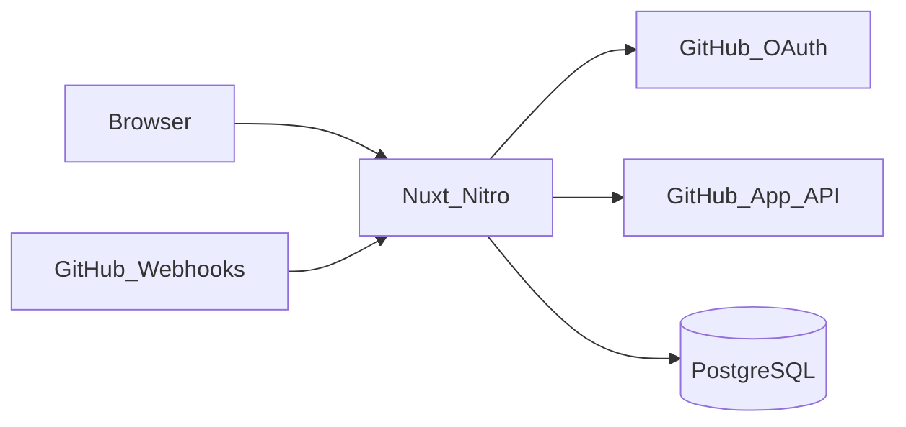

# ReviewForge

**ReviewForge** is an open-source web app for managing GitHub pull requests across repositories. Sign in with GitHub, connect repositories via a **GitHub App**, and browse PRs with a modern UI built on [Nuxt 4](https://nuxt.com/) and [Nuxt UI](https://ui.nuxt.com/).

The codebase is structured for extension: PR comments, checks, deployments, and **Cursor SDK** (or other) agentic reviews can plug in behind clear server-side boundaries.

## Features (v1)

- GitHub OAuth sign-in ([`nuxt-auth-utils`](https://github.com/atinux/nuxt-auth-utils))
- GitHub App installation for repository selection and scoped API access
- Dashboard of linked installations and repositories
- Per-repository pull request list (open / closed / all) with short-lived server cache
- Webhook ingestion for installation lifecycle (`installation`, `installation_repositories`)
- PostgreSQL + [Drizzle ORM](https://orm.drizzle.team/) migrations
- Docker Compose for local full-stack runs

## Documentation

- **[GitHub OAuth + GitHub App + local run (step-by-step)](./docs/CONFIGURATION.md)** — start here for credentials and `npm run dev`.
- **[`.env.example`](./.env.example)** — all environment variables.

## Quick start (Docker Compose)

1. Copy [`.env.example`](./.env.example) to `.env` and fill in secrets (see [docs/CONFIGURATION.md](./docs/CONFIGURATION.md)).
2. Create a **GitHub OAuth App** and a **GitHub App** (same doc).
3. Run:

```bash
docker compose up --build
```

4. Open [http://localhost:3000](http://localhost:3000), sign in, then use **Connect repositories** to install the GitHub App.

> After installing the GitHub App, GitHub redirects to the **Setup URL** configured in the GitHub App settings. Set it to `{NUXT_PUBLIC_BASE_URL}/api/auth/github/setup` so the installation is linked to your logged-in user.

## Local development (app on host, npm)

Requirements: **Node.js 24+** and **npm**.

```bash
cp .env.example .env
# Start Postgres (e.g. docker compose up -d db only), then edit DATABASE_URL in .env.
npm install
npm run db:migrate:prod
npm run dev
```

Full GitHub and env details: **[docs/CONFIGURATION.md](./docs/CONFIGURATION.md)**.

## Scripts

| Script | Description |
|--------|-------------|
| `npm run dev` | Nuxt dev server |
| `npm run build` | Production build |
| `npm run lint` / `typecheck` / `test` | Quality gates |
| `npm run db:generate` | Generate SQL from `server/db/schema.ts` |
| `npm run db:migrate` | Apply migrations (drizzle-kit, dev) |
| `npm run db:migrate:prod` | Apply migrations (runtime `drizzle-orm` migrator, used in Docker) |

## Architecture (high level)



- OAuth identifies the user (`users` table).
- GitHub App installation grants repository-scoped tokens (`installations`, `repositories`, `user_installations`).
- PR lists are fetched on demand via installation-authenticated Octokit (not stored in v1).

## Roadmap

- PR detail, comments, and review threads
- Cursor SDK (and optional OpenCode) agentic reviews behind `server/services/ai/*`
- Deployments, checks, and notifications

## License

MIT — see [LICENSE](./LICENSE).

## Contributing

See [CONTRIBUTING.md](./CONTRIBUTING.md) and [CODE_OF_CONDUCT.md](./CODE_OF_CONDUCT.md).

Security disclosures: [SECURITY.md](./SECURITY.md).
